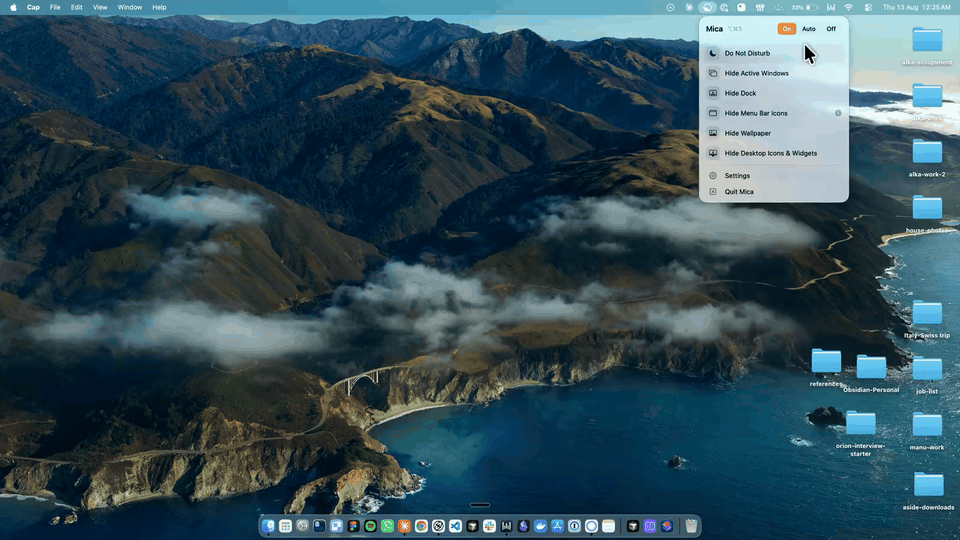

# mica-web

The landing page for [Mica](https://github.com/Vedant-29/mica), a macOS menu bar app that hides your desktop before anyone else sees it. Includes the home page, FAQ, privacy policy, and terms.

[Live site](https://mica.vedantagrw.com) · [Download Mica](https://github.com/Vedant-29/mica/releases/latest/download/Mica.dmg)

Related: [mica](https://github.com/Vedant-29/mica) (the macOS app this page describes and links to)



The full clip is in [static/media/reveal.mp4](static/media/reveal.mp4).

Click the image to watch the demo video shown on the home page.

Built with SvelteKit 2 and Svelte 5. Every route is prerendered, so the deployed site is plain static files. The `adapter-cloudflare` adapter is there only so a Worker route can be added later.

## Requirements

- Node 22 (the version CI uses)
- A Cloudflare account, only if you want to deploy

## Setup

```sh
git clone https://github.com/Vedant-29/mica-web.git
cd mica-web
npm install
npm run dev
```

Open http://localhost:5173. `npm run build` writes the site to `.svelte-kit/cloudflare`, and `npm run preview` serves that build.

Running locally needs no accounts or keys. The page itself has no analytics, cookies, or tracking scripts, and loads no outside fonts or scripts.

## Services

| Service | Used for | Required | Env vars |
|---|---|---|---|
| Cloudflare Pages | Hosting and deploys | Only to deploy | `CLOUDFLARE_API_TOKEN`, `CLOUDFLARE_ACCOUNT_ID` |
| GitHub Releases (app repo) | The download button | No setup | None |

### Cloudflare Pages

- Create a Pages project in the Cloudflare dashboard (Workers & Pages). The deploy script and workflow use the project name `mica`, so change `--project-name` in `package.json` and `.github/workflows/deploy.yml` if yours differs.
- Create an API token under My Profile > API Tokens with Account > Cloudflare Pages > Edit. The account ID is on the account home page.
- Attach a custom domain in the Pages project settings if you want one.
- Bring your own account and token. None are included in this repo.

### GitHub Releases

The download button points at `https://github.com/Vedant-29/mica/releases/latest/download/Mica.dmg`. GitHub resolves that to the newest non-prerelease asset, so cutting a Mica release updates the download with no rebuild here.

## Environment variables

These are needed only for deploying, not for `npm run dev`.

| Variable | Required | What it is for | Where to get it |
|---|---|---|---|
| `CLOUDFLARE_API_TOKEN` | For CI deploys | Lets wrangler publish to Pages | Cloudflare dashboard > My Profile > API Tokens |
| `CLOUDFLARE_ACCOUNT_ID` | For CI deploys | The account the Pages project lives in | Cloudflare dashboard > account home |

In CI both come from repository secrets. Locally, `npx wrangler login` is enough instead.

## Deployment

Pushing to `main` builds and publishes to Cloudflare Pages through `.github/workflows/deploy.yml`. It can also be run by hand from the Actions tab.

To publish from your machine, for example to check a build before pushing:

```sh
npm run deploy
```

## Notes

- The download button points at `releases/latest/download/Mica.dmg` in the app repo. Publishing a release there updates the download here without a rebuild. Do not commit a `.dmg` to this repo.
- The site URL and app repo link are hardcoded as `SITE` and `REPO` constants at the top of each `+page.svelte` in `src/routes/`, and `REPO` again in `src/lib/components/DocPage.svelte`. A fork needs to change them there.
- `static/media/` holds web-sized screenshots and video. The raw captures live in `assets/raw/`, which is gitignored because the source recording is about 95 MB.
- Screenshots must not show personal data, such as desktop folder names. Check each new capture before adding it.
- The demo video was re-encoded to about 284 KB with:

```sh
ffmpeg -i raw.mp4 -an -vf "scale=1600:-2,fps=30" \
  -c:v libx264 -preset slow -crf 30 -pix_fmt yuv420p -movflags +faststart \
  static/media/reveal.mp4
```

## License

MIT. See the [LICENSE](https://github.com/Vedant-29/mica/blob/main/LICENSE) in the app repo.
