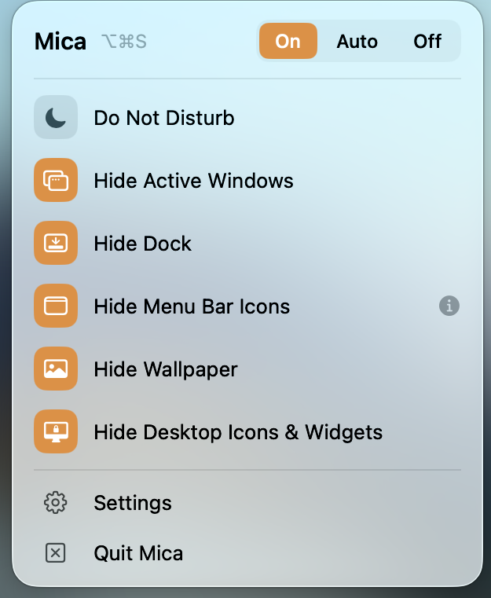

# mica-web

The landing page for [Mica](https://github.com/Vedant-29/mica), a macOS menu bar app that hides your desktop before anyone else sees it. Includes the home page, FAQ, privacy policy, and terms.

[Live site](https://mica.vedantagrw.com) · [Download Mica](https://github.com/Vedant-29/mica/releases/latest/download/Mica.dmg)



Built with SvelteKit 2 and Svelte 5. Every route is prerendered, so the deployed site is plain static files.

## Requirements

- Node 22 (the version CI uses)

## Setup

```sh
git clone https://github.com/Vedant-29/mica-web.git
cd mica-web
npm install
npm run dev
```

Open http://localhost:5173. `npm run build` writes the site to `.svelte-kit/cloudflare`, and `npm run preview` serves that build.

## Deployment

Pushing to `main` builds and publishes to Cloudflare Pages through `.github/workflows/deploy.yml`.

To publish by hand, for example to check a build before pushing:

```sh
npm run deploy
```

This needs `CLOUDFLARE_API_TOKEN` and `CLOUDFLARE_ACCOUNT_ID`. In CI they come from repository secrets.

## Notes

- The download button points at `releases/latest/download/Mica.dmg` in the app repo. Publishing a release there updates the download here without a rebuild. Do not commit a `.dmg` to this repo.
- `static/media/` holds web-sized screenshots and video. The raw captures live in `assets/raw/`, which is gitignored because the source recording is about 95 MB.
- The demo video was re-encoded to about 284 KB with:

```sh
ffmpeg -i raw.mp4 -an -vf "scale=1600:-2,fps=30" \
  -c:v libx264 -preset slow -crf 30 -pix_fmt yuv420p -movflags +faststart \
  static/media/reveal.mp4
```

## License

MIT. See the [LICENSE](https://github.com/Vedant-29/mica/blob/main/LICENSE) in the app repo.
